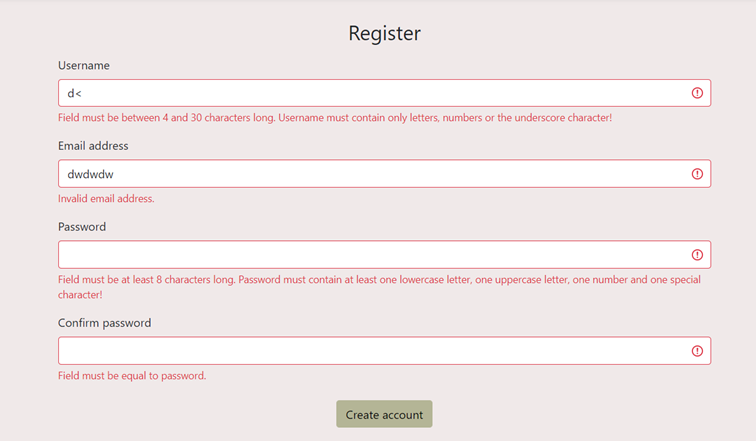

# Password Manager
Project made for Data Security course. Its purpose was to learn about mechanisms and best practises for creating secure web apps. It includes authentication, secure password storage and sharing passwords with other users.

Security used:
* hashing the user's password with sha256 followed by hashing with bcrypt,
* slowing down password verification,
* symmetric encryption of stored passwords to services with the AES algorithm,
* session consistency check using CSRF tokens,
* monitoring of failed login attempts.

## Technologies
Project is made with:
* Python 3.9
* Flask
* Jinja2
* SQLite

[All requirements](requirements.txt)

## Setup local environment
Install all requirements:

```shell
pip install -r requirements.txt
```

Create database from the python shell:
```shell
>>> from app import db
>>> db.create_all()
```

Run the app:

```shell
python -m flask run
```

## Features
<ul>
  <li>
    <p>Form data validation</p>
    
  </li>
  <li>
    <p>Password quality checking</p>
    <div>
      </br>  
      </br>
      
    </div>
  </li>
  <li>
    <p>Adding passwords to services</p>
    
  </li>
  <li>
    <p>Managing saved passwords</p>
    
  </li>
  <li>
    <p>Sharing passwords to services with other users</p>
    
    
  </li>
  <li>
    <p>Viewing passwords from other users</p>
    
  </li>
  <li>
    <p>Hiding/showing passwords</p>
    
    
    
  </li>
  <li>
    <p>Password change</p>
    
  </li>
  <li>
    <p>Resetting a lost password</p>
    </br></br>
    </br></br>
    
  </li>
</ul>


